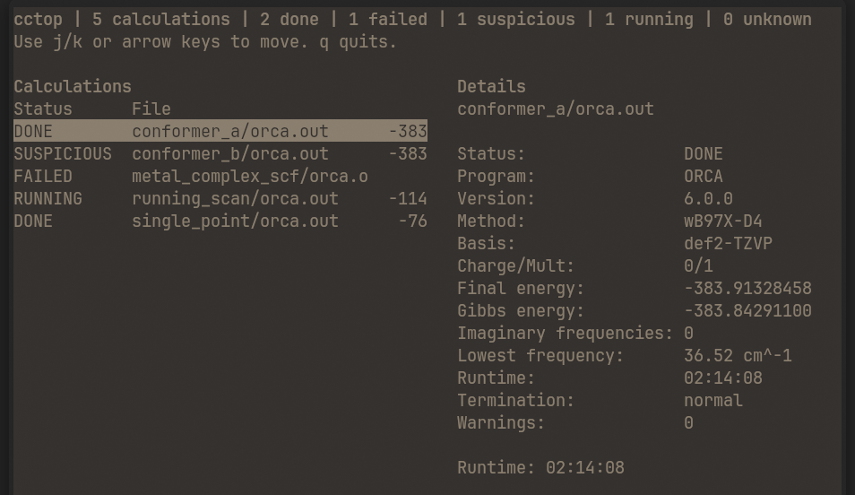

# cctop

`cctop` is a minimal terminal dashboard for computational chemistry output folders.



- ORCA output parsing.
- Experimental VASP, Gaussian, Q-Chem, and xTB/CREST parsing.
- Directory scan.
- Single-file inspect.
- CSV/JSON export.
- ORCA optimization energy and bond-distance text export.
- Basic terminal UI when run in a real terminal.

## Support

Current:

- ORCA: status, final energy, method/basis, charge/multiplicity, Gibbs energy, frequencies, runtime, and common warning markers.
- VASP: experimental `OUTCAR` and `OSZICAR` detection, status, final energy, runtime, and convergence markers.
- Gaussian: experimental `.log`/`.out` status, route method/basis, charge/multiplicity, final energy, frequencies, runtime, and termination markers.
- Q-Chem: experimental status, method/basis, charge/multiplicity, final energy, frequencies, runtime, and convergence markers.
- xTB/CREST: experimental status, method hints, final energy, runtime, and convergence markers.
- ORCA optimization history: electronic energy from `orca.out` and one zero-based atom-pair distance from `orca_trj.xyz`.

Not yet supported:

- `vasprun.xml`
- Rich per-step convergence history
- Program-specific tables beyond the shared summary fields

## Usage

```bash
cctop .
cctop job_001 job_002 job_003
cctop path/to/orca.out
cctop export .
cctop export batch_a batch_b --format json
cctop export . --format json
cctop orca-history path/to/job 0 12
```

Directory scans recurse into subdirectories, so `cctop .` works for project folders with one job per subfolder.

When stdout is not attached to a terminal, `cctop` prints a plain text summary instead of opening the TUI.

Try the demo data:

```bash
cctop testing/demo_orca_project
```

For an ORCA optimization job whose output is `orca.out` and trajectory is `orca_trj.xyz`, export gnuplot-friendly histories with:

```bash
cctop orca-history path/to/job 0 12 --energy-output energy.txt --distance-output bond.txt
```

The atom indices are zero-based. Each text file contains two columns: optimization step and value.

## Install

From PyPI:

```bash
pipx install compchem-cctop
```

or:

```bash
python -m pip install compchem-cctop
```

For a local checkout:

```bash
python -m pip install -e .
```

For an isolated command-line install:

```bash
pipx install .
```

## Development

```bash
python -m pip install -e ".[dev]"
python -m cctop .
python -m unittest discover -s tests
```

The test suite includes small real-output fixtures from cclib and pymatgen, with their licenses included under `tests/fixtures/real/`.
